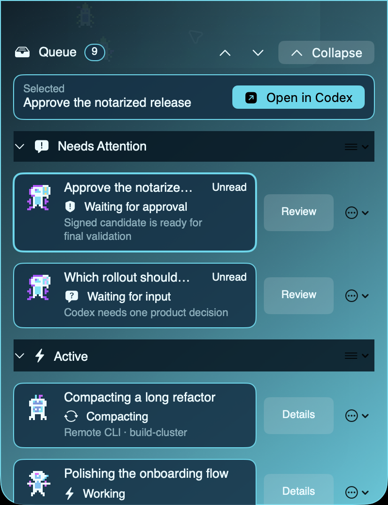
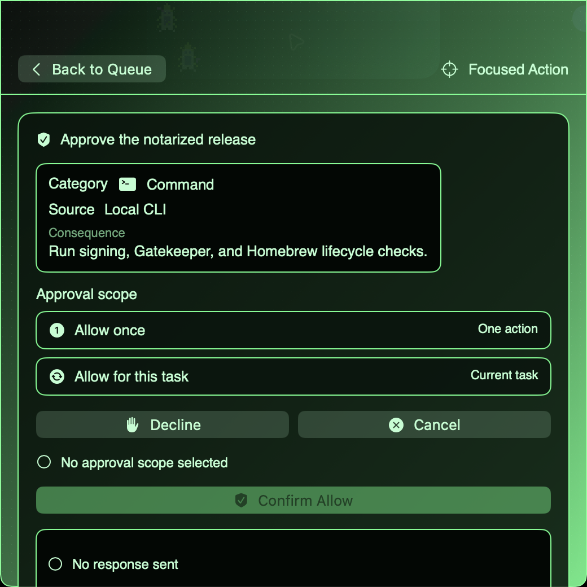
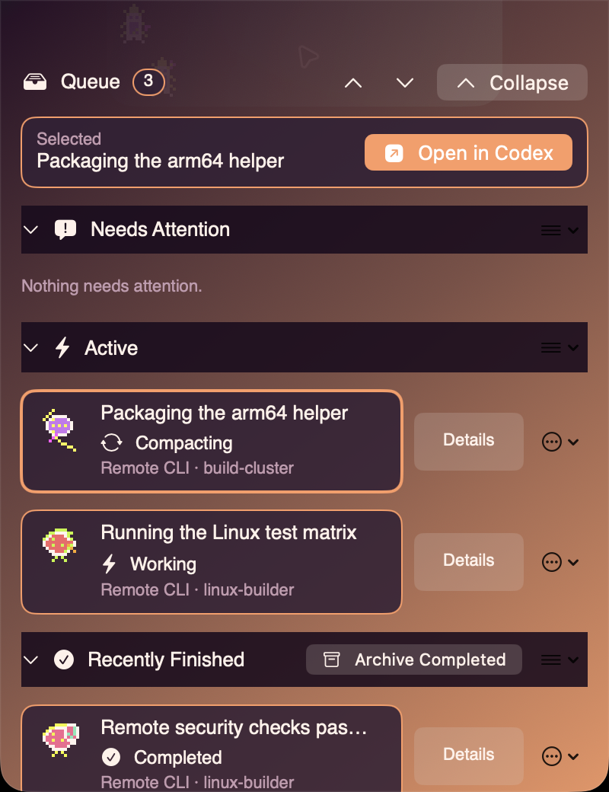

# Codex Cove

Codex Cove is a local-only macOS companion for Codex CLI and Codex Desktop. It
turns task activity into a small notch-aligned island, brings approvals and
questions into an attention-first queue, and can return you to the exact
terminal, editor window, or Codex task where work began.

<p align="center">
  
</p>

<p align="center">
  <strong>One glance. Every agent.</strong><br>
  <sub>The notch-sized island keeps active, remote, waiting, and completed work visible without taking over your desktop.</sub>
</p>

<p align="center">
  
  
</p>

<p align="center">
  <sub><strong>Native Glass · Ocean</strong> — a live command center &nbsp;&nbsp;&nbsp; <strong>Retro Terminal · Terminal Green</strong> — approvals without context switching</sub>
</p>

<p align="center">
  
</p>

<p align="center">
  <strong>Local, desktop, and remote work—one attention layer.</strong><br>
  <sub>Exact origins stay visible, including the selected SSH host, in Minimal OLED · Sunset.</sub>
</p>

Codex Cove is built only for Codex. It has no account system, telemetry, cloud
backend, advertising, licensing service, online updater, or private Codex
storage access.

> **Release status:** the source tree is currently version `0.7.0`. Check
> [GitHub Releases](https://github.com/cdimartino/codex-cove/releases) for
> public binary availability. Local packages are signed ad hoc unless a signing
> identity is supplied; distribution artifacts must pass the protected release
> pipeline before they are described as Developer ID signed and notarized.

## Install with Homebrew

For a public GitHub release whose matching Cask has landed, install the
notarized Apple Silicon app from the explicit public tap:

```sh
brew tap cdimartino/codex-cove https://github.com/cdimartino/codex-cove.git
brew trust --cask cdimartino/codex-cove/codex-cove
brew install --cask cdimartino/codex-cove/codex-cove
```

The Cask installs `Codex Cove.app` in `~/Applications` and runs its bundled
helper to apply the same current-user Codex hooks, management command, and
editor integration as the manual installer. It does not approve hook trust or
macOS permissions, and it does not replace the native `codex` command.
Codex Cove does not depend on the deprecated `codex-app` Homebrew Cask. If
Homebrew reports that `codex-cove` is unavailable, do not install a similarly
named suggestion; update the tap or use the source or verified manual path. See
[Installation](docs/INSTALLATION.md#install-with-homebrew) for details.

## Highlights

- A compact collapsed island with animated task residents and semantic cues
  for active, waiting, completed, failed, blocked, and interrupted work.
- An expandable queue with collapsible, reorderable sections; search; row-level
  context actions; pinning; reminders; unread state; and recoverable local or
  bulk completed-task archives.
- A Workspace-first window with a reorderable responsive Grid, independent
  custom-column Board, recursive subagent inspector, compound filters, Cove-only
  aliases/tags/artifacts, and a saved prompt library.
- Exact-origin navigation for Terminal, iTerm2, tmux, WezTerm, VS Code, Cursor,
  remote CLI sessions, and Codex Desktop tasks.
- Native Glass, Retro Terminal, and Minimal OLED styles, five built-in palettes,
  live color-wheel custom-theme authoring, solid or two-color translucent
  surfaces, JSON import/export, scalable text, configurable geometry, Reduce
  Motion support, notifications, and per-event sounds.
- Dungeon/D&D, tech-creature, and virus/bacteria resident sets with stable
  per-task assignment.
- Privacy modes, content-level notification controls, quiet hours, project
  silence rules, focused-app quieting, and a restorable menu-bar-level minimal
  cue.
- Optional account rate-limit and token-usage views sourced only from public
  Codex app-server responses. Missing or stale values are labeled, never
  inferred.
- Current-user installation with checksum-gated repair and removal, structural
  preservation of unrelated Codex hooks, and an opt-in SSH relay for selected
  remote hosts.

## Supported environments

The Cove app requires an Apple Silicon Mac running macOS 14 or newer. Its
optional remote helper supports Apple Silicon and Intel macOS and glibc-agnostic
musl builds for arm64 and x86_64 Linux.

| Surface | Integration | Additional permission or tool |
| --- | --- | --- |
| Codex CLI | Native hooks by default; explicit `codex-cove launch` for broker-routed approvals and questions | Trust the installed hook; put `~/bin` on `PATH` only for the helper command |
| Codex Desktop | Public loaded-thread reconciliation, Cove-owned turn start/steer, and exact `codex://` task links | Codex Desktop installed |
| Terminal.app | Exact tab restoration by TTY | Terminal Automation permission |
| iTerm2 | Exact session restoration by TTY | iTerm Automation permission |
| VS Code 1.92+ | Bundled extension, routed terminals, exact terminal and window focus | Accessibility permission for exact window focus |
| Cursor 1.92+ API-compatible builds | Same bundled extension and focus protocol | Accessibility permission for exact window focus |
| tmux / WezTerm | Exact pane selection when pane metadata is available | Corresponding CLI installed |
| Selected SSH aliases | Explicitly deployed remote helper and relay | Preconfigured non-interactive SSH authentication |

Other terminal hosts may be restored through an opaque OSC title marker when
they expose one, but they are not part of the primary compatibility matrix.

## Quick start from source

Install the prerequisites first:

- Swift 6.0 or newer
- Rust 1.85 or newer
- Node.js 22 or newer
- Codex CLI 0.147.0 or newer
- GNU Make and the macOS code-signing tools
- Full Xcode 26.6 or newer for `make bootstrap` and the UI-test release gate

Then clone, verify, test, and install:

```sh
git clone https://github.com/cdimartino/codex-cove.git
cd codex-cove
make deps
make bootstrap
make test
make install
open "$HOME/Applications/Codex Cove.app"
"$HOME/bin/codex-cove" doctor
```

`make install` builds the app, installs it at
`~/Applications/Codex Cove.app`, installs the VS Code/Cursor extension where
the corresponding editor CLI is available, and applies current-user Codex
integration. It stops a running Cove instance before replacement and does not
relaunch it.

Start native Codex normally. Use Cove's explicit launcher only when you want
approvals and questions handled inside Cove:

```sh
codex
"$HOME/bin/codex-cove" launch
```

For VS Code or Cursor, run **Cove: Create Routed Terminal** from the Command
Palette for the strongest launch-to-terminal binding. Existing integrated
terminals can be registered with **Cove: Register Active Terminal**.

See [Installation](docs/INSTALLATION.md) for Homebrew and manual binary
releases, macOS permissions, remote helpers, upgrades, and safe removal.

## Everyday use

Launch or reopen Codex Cove to open Workspace. Use the menu-bar wave icon to
show the ambient island, switch privacy,
mute sounds, restore the full island, open Settings or Doctor, and restore
locally archived tasks. The island never expands merely because an event
arrives; it opens only during explicit interaction.

The app's Help menu, menu-bar **Help…** action, Workspace help icon, and each
Settings-pane help icon open the maintained [user](docs/USER_GUIDE.md),
[Workspace](docs/WORKSPACE.md), and [Settings](docs/SETTINGS.md) guides.

Opening **Workspace** gives Cove a normal Dock/App-Switcher presence for as long
as that window is open. Grid supports manual drag ordering only when no search
or filter is active, plus undoable Move Earlier/Later commands. Board starts
with Inbox, Doing, Review, and Blocked; its workflow placement is independent
from live Codex status. Selecting a card opens its recursive agent hierarchy,
latest memory-only output, approval/question controls, Cove-only metadata, and
prompt composer without marking it read.

The prompt library stores only templates you explicitly save. Choosing one
copies it into an editable memory-only composer. Sending starts an idle turn or
steers the exact active turn when Cove has a validated Desktop, routed-local,
or routed-remote control path. Pending requests, hook-only tasks, stale or
ambiguous routes, and uncertain delivery fall back to **Open in Codex**; prompt
delivery is never retried automatically.

When global shortcuts are enabled and Cove has Accessibility access:

- `Command-Shift-O` toggles Cove.
- `Command-Shift-E` toggles the expanded queue.
- `Command-Shift-T` returns to the most recently registered origin.

Approvals use select-then-confirm controls. Cove answers only authoritative
requests from an explicitly broker-routed `codex-cove launch` session.
Unsupported, hook-only, or ambiguous requests stay in the native Codex client,
where Cove offers an **Open in Codex** action.
Archiving in Cove hides local metadata only; it never archives or deletes the
underlying Codex task.

The complete interaction reference is in the [User Guide](docs/USER_GUIDE.md).

## Development

```sh
make deps       # resolve locked dependencies and reject npm advisories
make bootstrap  # read-only toolchain and dependency checks
make build      # Swift app, Rust helper, TypeScript extension
make test       # Swift foundations, Rust tests, extension tests
make ui-test    # XCUITest; full Xcode and an unlocked console required
make run        # uninstalled development app only
```

`make run` does not install the helper, hooks, editor extension, login item, or
remote helper. SwiftPM and `scripts/package-app.sh` are authoritative for
production builds. `CodexCoveUITests.xcodeproj` is the source-tree UI-test host
and can be regenerated after an intentional project-spec change:

```sh
xcodegen generate --spec XcodeProject.yml --project .
```

GitHub CI runs locked dependency installation with a zero-advisory npm audit,
builds, tests, static checks, UI-test compilation, an ad-hoc packaging smoke
test, and checksummed cross-builds for all four remote helper targets. Both
Linux-musl targets compile every Cargo target before their release binaries are
collected. Binary publication is a separate manual workflow: it accepts only
an existing strict version tag on the protected default branch and fails unless
candidate evidence, Developer ID signing, notarization, Gatekeeper assessment,
and checksums all pass. See [Release Process](docs/RELEASES.md).

## Project map

| Path | Responsibility |
| --- | --- |
| `Sources/CodexCoveApp` | AppKit lifecycle, SwiftUI surfaces, notifications, sounds, exact-origin focus |
| `Sources/CoveCore` | State reduction, persistence, themes, IPC models, usage aggregation |
| `helper` | Rust launcher, hook, broker, diagnostics, installation, remote relay |
| `extension` | Private VS Code/Cursor extension and exact-terminal focus service |
| `schemas` | Versioned cross-language IPC contracts |
| `Tests`, `UITests` | Foundation, cross-language, integration, and XCUITest coverage |
| `Packaging`, `scripts` | App assembly, signing, installation, candidate identity, smoke tests |

For data flows and trust boundaries, see [Architecture](docs/ARCHITECTURE.md)
and [Security & Privacy](docs/SECURITY.md).

## Documentation

- [Documentation index](docs/README.md)
- [Installation](docs/INSTALLATION.md)
- [User Guide](docs/USER_GUIDE.md)
- [Architecture](docs/ARCHITECTURE.md)
- [Security & Privacy](docs/SECURITY.md)
- [Troubleshooting](docs/TROUBLESHOOTING.md)
- [Contributing](docs/CONTRIBUTING.md)
- [Release Process](docs/RELEASES.md)
- [Protocol contract](docs/PROTOCOL.md)

Version-specific execution and validation records live under `docs/` as release
engineering evidence; they are not a substitute for the user guides above.

## Privacy in one paragraph

Unsaved composer text, prompts submitted to Codex, responses, commands, diffs,
token metrics, and request details are not written to Cove's durable store.
Saved Workspace aliases, tags, validated HTTP(S) and local-file artifacts, workflow organization,
and prompt-library templates are an explicit local exception in a versioned,
mode-`0600` `workspace.json`. When notifications are enabled, macOS
Notification Center may retain delivered banner content according to system
settings. Cove otherwise persists settings plus bounded task metadata such as
opaque task and launch identifiers, status, unread and reminder state,
timestamps, source, and opaque terminal-location identifiers. Local runtime
directories and files are current-user only. Event diagnostics redact sensitive
payload fields; Doctor may show the local paths it inspected, so review its
output before sharing. Cove contacts no service of its own; remote transport is
opened only to SSH aliases you explicitly add, while Codex continues to use its
own network services.

## License

Codex Cove is available under the [MIT License](LICENSE).
