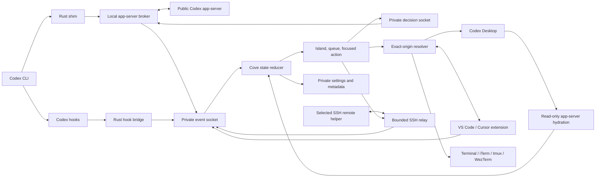

# Architecture

Codex Cove is a native Swift menu-bar app surrounded by small adapters for
Codex CLI, Codex Desktop, supported editors, and opt-in remote hosts. All Cove
coordination is local except the explicit SSH relay to a user-selected host.

## System overview

## Repository components

### `Sources/CodexCoveApp`

The executable target owns application lifecycle and macOS integration:

- a single-instance lock and reveal behavior;
- the top-center AppKit panel and SwiftUI surfaces;
- menu-bar controls and the reusable Settings window;
- global keyboard monitoring, Accessibility focus, Apple-event terminal focus,
  notifications, sounds, launch at login, and sleep/session handling;
- local Unix socket ingestion and remote-relay lifecycle; and
- bridges from in-memory task state to bounded metadata persistence.

`CoveStore` is the main-actor coordinator between the pure state model and
external side effects. A fixture mode replaces those side effects for XCUITest
and refuses to run under the UI-test bundle identifier without an isolated
fixture configuration.

### `Sources/CoveCore`

The library target contains cross-surface behavior that can be tested without a
running app:

- versioned wire envelopes and state reduction;
- task projection, ordering, status aggregation, and origin scoping;
- approval and question state machines;
- notification policy and startup buffering;
- settings, themes, typography, geometry, and contrast;
- public account-usage and token-usage aggregation; and
- settings JSON and bounded SQLite session-metadata storage.

The reducer tolerates unknown event kinds and rejects stale updates. Origin is
a composite of source and, for remote work, host identity; identical external
session IDs from different origins are not merged.

### `helper`

The Rust executable has two public identities:

- invoked as `codex`, it is a shim that locates and `exec`s the original Codex
  binary after attempting Cove routing; and
- invoked as `codex-cove`, it manages installation, diagnostics, privacy,
  themes, remote hosts, hook delivery, and relay processes.

For a routed local CLI launch, the helper creates an opaque launch identifier,
a private broker socket, and a private decision socket. The production broker
accepts Codex's WebSocket-over-Unix app-server transport at `/rpc`, translates
messages to newline-delimited JSON on an official app-server process, and
preserves JSON-RPC objects in both directions.

The install subsystem performs ownership and identity checks before mutation,
stages replacements, validates commit state, and rolls back when a transaction
cannot complete. Its manifest records the exact app, helper, hooks, links, and
editor cleanup obligations that a later repair or uninstall may touch.

### `extension`

The private TypeScript extension targets the public VS Code 1.92 API also used
by compatible Cursor builds. It:

- creates routed integrated terminals;
- registers existing terminals and process metadata;
- publishes content-free terminal registration/status events;
- owns a per-editor-window private focus socket; and
- selects and verifies an exact terminal on request.

Each extension-host window advertises a content-free marker containing a random
12-character identifier. The native app requires exactly one matching
Accessibility anchor before it raises a window. The focus transaction is:

1. `prepare`: the extension selects the exact terminal;
2. native focus: Cove locates, activates, and raises the uniquely marked editor
   window; and
3. `focus`: the extension confirms the requested terminal and window are both
   focused.

The transaction has bounded I/O and fails if the socket, terminal, marker,
window, or response is stale or ambiguous.

### `schemas`, `Fixtures`, and `Tests/Fixtures`

Four JSON schemas define the public Cove envelope, decision frame, interactive
request, and theme document. The root fixtures are readable examples;
`Tests/Fixtures` are copied test inputs. Extension tests assert that the
TypeScript side and Swift/Rust consumers agree on the same contracts.

## Local CLI event flow

1. A shell resolves `codex` to Cove's managed link.
2. The shim validates configuration and locates a different, executable native
   Codex binary.
3. Commands that must remain direct, including explicit remote invocation, are
   immediately `exec`ed without Cove routing.
4. For eligible interactive work, the shim asks Codex to bootstrap its durable
   app-server daemon, probes the public proxy, and falls back to direct stdio
   only when advertised and responsive.
5. The broker starts on a private opaque Unix socket and registers launch
   metadata with the Cove app.
6. App-server notifications and authoritative server requests become versioned
   Cove events. The reducer projects them into the island and queue.
7. A confirmed decision is written once to the launch's validated decision
   socket and correlated by launch and request ID.

If configuration, broker startup, or both public app-server modes fail, the shim
prints a bounded diagnostic and `exec`s native Codex. Cove availability must not
make the terminal unusable.

## Hook and Desktop flow

The hook bridge reads one public Codex hook object from standard input and sends
the minimum corresponding event to Cove. A missing or unresponsive Cove returns
success with empty output so native Codex remains authoritative. Ambiguous
permission hooks likewise remain native.

Desktop hydration first probes the existing public app-server proxy and then
uses one bounded stdio connection if necessary. It calls `thread/list` only to
identify a small set of candidate tasks and reads each exact task with
`includeTurns=false`. Responses are correlated by JSON-RPC ID and may arrive
out of order. Exact navigation uses the public Codex deep link.

When Codex Desktop is already the primary durable client, Cove does not start,
restart, or manage its daemon.

## Remote flow

Remote support starts only for aliases explicitly saved through
`codex-cove remote add`. The local app opens a persistent non-interactive SSH
relay with strict host-key checking and bounded connection/keepalive behavior.
The deployed helper runs the same shim, hook, broker, and relay logic on macOS
or Linux.

Events use the same JSON envelope with a `remoteCli` source and opaque host ID.
Remote control frames are length-prefixed and correlated by a unique control
ID. A `delivered` acknowledgement means the remote helper wrote and flushed the
complete frame to the validated decision socket; it does not mean downstream
Codex accepted the action. Disconnecting a relay invalidates its generation's
routes and fails pending sends.

## Persistence model

Cove separates transient task content from durable metadata.

| Store | Durable contents | Excluded contents |
| --- | --- | --- |
| `settings.json` | Versioned user settings only | Sessions, prompts, task text |
| `sessions.sqlite3` | Opaque IDs, source, status, unread/reminder state, bounded timestamps, opaque terminal-location metadata | Prompts, responses, commands, diffs, token values, absolute socket paths |
| `session-pins.json` | Opaque pinned session IDs | Task content |
| `dismissed-sessions.json` | Opaque locally archived session IDs | Codex archive state or transcript data |
| `Themes/` | Validated imported theme JSON | Codex content |
| `Sounds/Imported/` | Manifest-owned validated audio copies | Original source paths |
| `helper-config.json` | Native Codex path, private runtime paths, privacy setting, explicitly selected SSH aliases | Prompts and SSH credentials |

All live task detail, token usage, and request content remains in memory. Recent
metadata is bounded on restore and records older than 90 days are pruned in
bounded batches.

## Failure and trust rules

- Unknown app-server fields are tolerated; unknown event kinds are ignored.
- Unsupported requests stay in native Codex.
- IDs are origin-scoped and ambiguous lookups fail closed.
- Decision delivery is single-flight and first matching response wins.
- Socket paths are reconstructed from strict opaque identifiers rather than
  persisted absolute paths.
- Local sockets and support directories must be owned by the current user and
  deny group/other access.
- Frames, handshakes, reads, writes, and child startup have explicit size and
  time bounds.
- Codex auto-review traffic is filtered before reduction or side effects.
- Cove never reads or writes private Codex storage.

Wire-level details and examples are maintained in [PROTOCOL.md](PROTOCOL.md).
