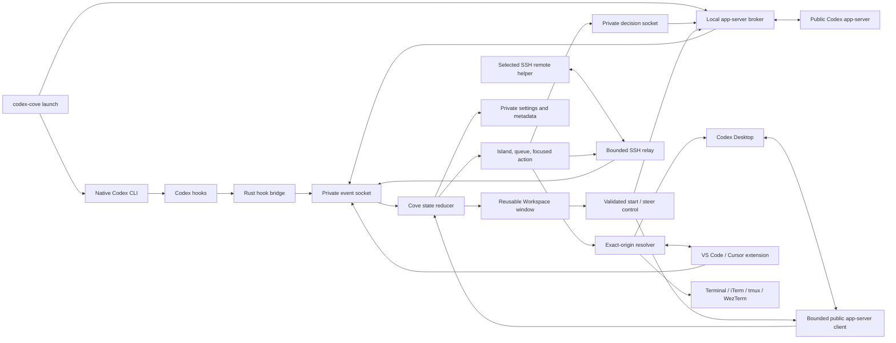

# Architecture

Codex Cove is a native Swift menu-bar app surrounded by small adapters for
Codex CLI, Codex Desktop, supported editors, and opt-in remote hosts. All Cove
coordination is local except the explicit SSH relay to a user-selected host.

## System overview

## Repository components

### `Sources/CodexCoveApp`

The executable target owns application lifecycle and macOS integration:

- a single-instance lock and reveal behavior;
- the top-center AppKit panel and SwiftUI surfaces;
- menu-bar controls and reusable Settings and Workspace windows;
- global keyboard monitoring, Accessibility focus, Apple-event terminal focus,
  notifications, sounds, launch at login, and sleep/session handling;
- local Unix socket ingestion and remote-relay lifecycle; and
- bridges from in-memory task state to bounded metadata and explicitly
  user-authored Workspace persistence.

`CoveStore` is the main-actor coordinator between the pure state model and
external side effects. A fixture mode replaces those side effects for XCUITest
and refuses to run under the UI-test bundle identifier without an isolated
fixture configuration.

### `Sources/CoveCore`

The library target contains cross-surface behavior that can be tested without a
running app:

- versioned wire envelopes and state reduction;
- task and recursive Workspace projection, ordering, status aggregation, and
  composite origin scoping;
- approval and question state machines;
- notification policy and startup buffering;
- settings, themes, typography, geometry, and contrast;
- public account-usage and token-usage aggregation; and
- settings and Workspace JSON plus bounded SQLite session-metadata storage.

The reducer tolerates unknown event kinds and rejects stale updates. Origin is
a composite of source and, for remote work, host identity; identical external
session IDs from different origins are not merged.

### `helper`

The Rust executable has two public roles:

- `codex-cove launch [CODEX_ARGS...]` explicitly locates and launches native
  Codex through Cove's broker; and
- other `codex-cove` commands manage installation, diagnostics, privacy,
  themes, remote hosts, hook delivery, and relay processes. Installation does
  not replace the native `codex` command.

For a routed local CLI launch, the helper creates an opaque launch identifier,
a private broker socket, a private decision socket, and a separate private
thread-control socket. The production broker
accepts Codex's WebSocket-over-Unix app-server transport at `/rpc`, translates
messages to newline-delimited JSON on an official app-server process, and
preserves JSON-RPC objects in both directions. Thread control accepts only
validated `turn/start` and exact-turn `turn/steer` requests, uses reserved
correlated JSON-RPC IDs, and intercepts only their matching responses.

The install subsystem performs ownership and identity checks before mutation,
stages replacements, validates commit state, and rolls back when a transaction
cannot complete. Its manifest records the exact app, helper, hooks, links, and
editor cleanup obligations that a later repair or uninstall may touch.

### `extension`

The private TypeScript extension targets the public VS Code 1.92 API also used
by compatible Cursor builds. It:

- creates routed integrated terminals;
- registers existing terminals and process metadata;
- publishes content-free terminal registration/status events;
- owns a per-editor-window private focus socket; and
- selects and verifies an exact terminal on request.

Each extension-host window advertises a content-free marker containing a random
12-character identifier. The native app requires exactly one matching
Accessibility anchor before it raises a window. The focus transaction is:

1. `prepare`: the extension selects the exact terminal;
2. native focus: Cove locates, activates, and raises the uniquely marked editor
   window; and
3. `focus`: the extension confirms the requested terminal and window are both
   focused.

The transaction has bounded I/O and fails if the socket, terminal, marker,
window, or response is stale or ambiguous.

### `schemas`, `Fixtures`, and `Tests/Fixtures`

Five JSON schemas define the public Cove envelope, decision frame, interactive
request, thread-control frames, and theme document. The root fixtures are
readable examples;
`Tests/Fixtures` are copied test inputs. Extension tests assert that the
TypeScript side and Swift/Rust consumers agree on the same contracts.
Thread-control uses generated in-memory success and rejection cases instead of
a checked-in request fixture, so prompt text and correlated control identifiers
cannot enter a public artifact.

## Local CLI event flow

1. A shell explicitly invokes `codex-cove launch` for a broker-routed session.
2. The launcher validates configuration and locates an executable native Codex
   binary.
3. Commands that must remain direct, including explicit remote invocation, are
   immediately `exec`ed without Cove routing.
4. For eligible interactive work, the launcher asks Codex to bootstrap its durable
   app-server daemon, probes the public proxy, and falls back to direct stdio
   only when advertised and responsive.
5. The broker starts on a private opaque Unix socket and registers launch
   metadata with the Cove app.
6. App-server notifications and authoritative server requests become versioned
   Cove events. The reducer projects them into the island and queue.
7. A confirmed decision is written once to the launch's validated decision
   socket and correlated by launch and request ID.
8. A Workspace prompt is written once to the launch's separate validated
   control socket. The broker rejects an unobserved session, wrong launch,
   stale active turn, oversized frame, or non-allowlisted method.

Normal `codex` launches skip these broker steps and emit only installed hook
events. If configuration, broker startup, or both public app-server modes fail,
the launcher prints a bounded diagnostic and `exec`s native Codex. Cove
availability must not make the terminal unusable.

## Hook and Desktop flow

The hook bridge reads one public Codex hook object from standard input and sends
the minimum corresponding event to Cove. A missing or unresponsive Cove returns
success with empty output so native Codex remains authoritative. Ambiguous
permission hooks likewise remain native.

Desktop reconciliation first probes the existing public app-server proxy and
then uses one bounded stdio connection if necessary. While the Workspace is
visible, startup, connection recovery, opening the window, and a bounded
background cadence page through `thread/loaded/list`, then read each exact task
with `thread/read` and `includeTurns=false`. Cove optionally requests a bounded
`thread/turns/list` summary so the card inspector can show the latest assistant
output. Responses are correlated by JSON-RPC ID and may arrive out of order.
The authoritative `parentThreadId`, loaded state, active turn, and source are
preserved through reduction. Spawned-agent provenance may arrive in
`source.subAgent.thread_spawn`; Cove follows at most 32 non-cyclic public
`thread/read` ancestors and accepts the task only when the root matches the
expected Desktop or CLI origin. Conflicts and internal review/compact sources
fail closed. Exact Desktop navigation uses the public Codex deep link, and
assistant output remains in memory only.

Workspace turns use a persistent bounded public app-server client. An idle
Desktop task maps to `turn/start`; an active task maps to `turn/steer` with its
exact observed turn ID. For an idle or completed hook-observed local CLI task,
the same client validates its exact public CLI source and state with a no-turn
read, installs an origin-owned route, and resumes it with turns excluded before
`turn/start`. Active local tasks and spawned agents additionally require a
bounded `thread/turns/list` result whose sole in-progress turn matches
`expectedTurnId` immediately before `turn/steer`. The client forwards
authoritative approval and question requests for
turns Cove starts through a private in-memory decision route to the existing
decision UI. State changes, pending requests, timeouts, and disconnects fail
visibly and are never retried automatically.

When Codex Desktop is already the primary durable client, Cove does not start,
restart, or manage its daemon.

## Remote flow

Remote support starts only for aliases explicitly saved through
`codex-cove remote add`. The local app opens a persistent non-interactive SSH
relay with strict host-key checking and bounded connection/keepalive behavior.
The deployed helper runs the same explicit launcher, hook, broker, and relay
logic on macOS or Linux.

Events use the same JSON envelope with a `remoteCli` source and opaque host ID.
Remote control frames are length-prefixed and correlated by a unique control
ID. Decision acknowledgements report complete writes to validated decision
sockets. Thread-control acknowledgements separately report `accepted`,
`rejected`, or `uncertain` for validated `turn/start` and exact-turn
`turn/steer` requests. Disconnecting a relay invalidates its generation's
decision and thread-control routes and fails pending sends.

## Workspace window

The Workspace is a single reusable normal-level `NSWindowController` backed by
the same main-actor `CoveStore` as the island. Opening it switches Cove from its
menu-bar accessory activation policy to a regular Dock and App-Switcher app;
closing it restores accessory mode. Its frame is restored independently from
Settings.

`CoveWorkspaceProjection` builds a recursive task hierarchy only from an
authoritative `parentThreadId` within the same `CoveSessionIdentity` origin.
Missing parents and cycles are shown as unattached agents instead of guessed.
Loaded Desktop tasks and live routed or hook sessions remain visible while
idle. Closed successful sessions leave the projection; closed failed or
interrupted sessions remain only while unread.

The Grid and Board are projections over the same state. Grid dragging mutates
manual order only when no search or filter is active; menu and keyboard moves
provide equivalent undoable actions. Board column assignment is independent
from live Codex status. Search, filters, sorts, aliases, tags, and links do not
change upstream Codex data.

Selecting an agent keeps its owning root card highlighted while the inspector,
Open action, and composer bind to the exact selected composite identity. Artifact
labels and a Workspace-global manual rank remain Cove-only; filtering that rank
to a parent hierarchy allows parent and child artifacts to interleave without
changing ownership.

App-server `item/agentMessage/delta` events update the exact session's bounded
in-memory `latestOutput`. Projection selects the newest output across each
owning root and its descendants for the root card; it does not persist a
transcript. Card residents reuse the existing stable session assignment and
pixel renderer, with settings and Reduce Motion controlling visibility and
active-state movement.

## Persistence model

Cove separates transient task content from durable metadata.

| Store | Durable contents | Excluded contents |
| --- | --- | --- |
| `settings.json` | Versioned user settings only | Sessions, prompts, task text |
| `sessions.sqlite3` | Opaque IDs, source, status, unread/reminder state, bounded timestamps, opaque terminal-location metadata | Prompts, responses, commands, diffs, token values, absolute socket paths |
| `workspace.json` | User-authored aliases, tags, HTTP(S) links and global artifact order, Grid/Board organization, and saved prompt templates | Favicons, unsaved composer text, submitted prompts, output, transcripts, approvals, commands, absolute socket paths |
| `session-pins.json` | Composite opaque pinned session identities | Task content |
| `dismissed-sessions.json` | Composite opaque locally archived session identities | Codex archive state or transcript data |
| `Themes/` | Validated imported theme JSON | Codex content |
| `Sounds/Imported/` | Manifest-owned validated audio copies | Original source paths |
| `helper-config.json` | Native Codex path, private runtime paths, privacy setting, explicitly selected SSH aliases | Prompts and SSH credentials |

`workspace.json` is a deliberate local-content exception: it is versioned,
atomically replaced, mode `0600`, and bounded before any valid document is
replaced. All live upstream task detail, submitted prompt text, output, token
usage, request content, and unsaved composer text remains in memory.
`sessions.sqlite3` uses a composite `(source, host scope, session ID)` primary
key. Legacy records migrate only when their origin is unambiguous; ambiguous
records remain preserved but inert and produce a content-free Doctor warning.
Recent metadata is bounded on restore and records older than 90 days are pruned
in bounded batches.

## Failure and trust rules

- Unknown app-server fields are tolerated; unknown event kinds are ignored.
- Unsupported requests stay in native Codex.
- IDs are origin-scoped and ambiguous lookups fail closed.
- Decision delivery is single-flight and first matching response wins.
- Prompt delivery is exact-origin, allowlisted, single-attempt, and never
  automatically retried after uncertain delivery.
- Socket paths are reconstructed from strict opaque identifiers rather than
  persisted absolute paths.
- Local sockets and support directories must be owned by the current user and
  deny group/other access.
- Frames, handshakes, reads, writes, and child startup have explicit size and
  time bounds.
- Codex auto-review traffic is filtered before reduction or side effects.
- Cove never reads or writes private Codex storage.

Wire-level details and examples are maintained in [PROTOCOL.md](PROTOCOL.md).
